<p align="center">
  
  
  
  
  
</p>

# 🚀 Backendify

**A self-hosted Backend-as-a-Service (BaaS) platform** — Build backends without writing backend code.

Backendify is an open-source alternative to Firebase/Supabase that you can run on your own infrastructure. Define your data schema through a visual UI, and get instant REST APIs with authentication, authorization, and real-time capabilities.

<p align="center">
  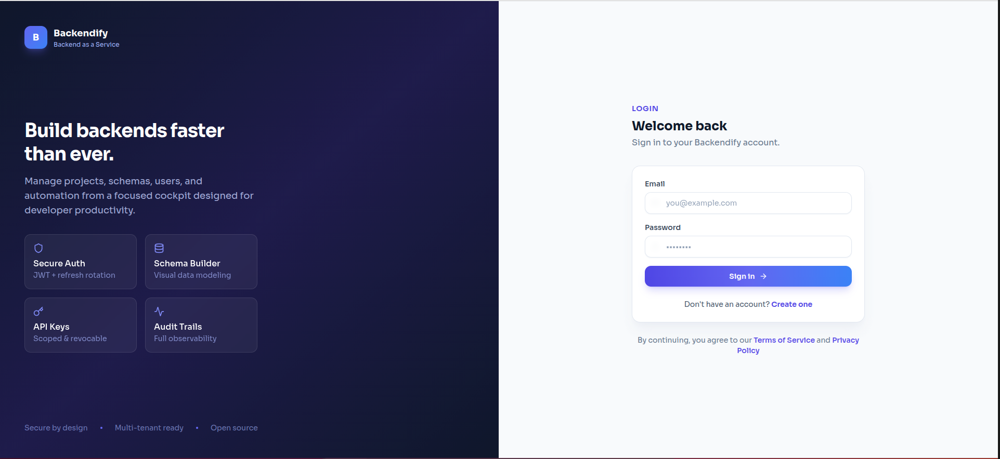
</p>

---

## 📸 Screenshots

### Control Center Dashboard
<p align="center">
  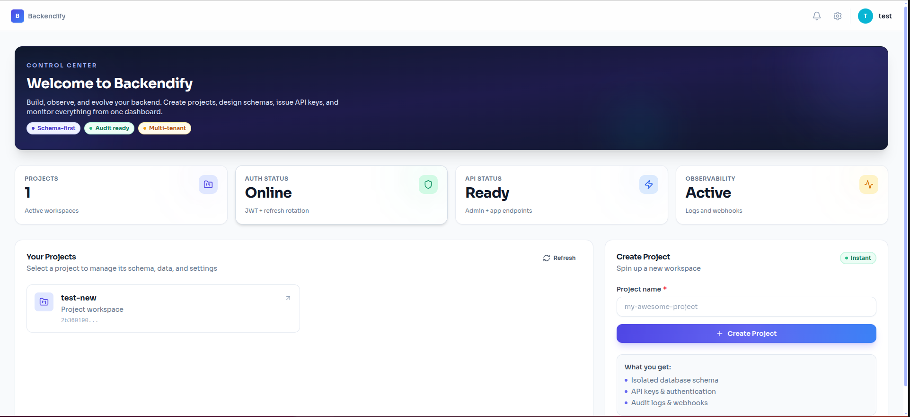
</p>

### Project Overview
<p align="center">
  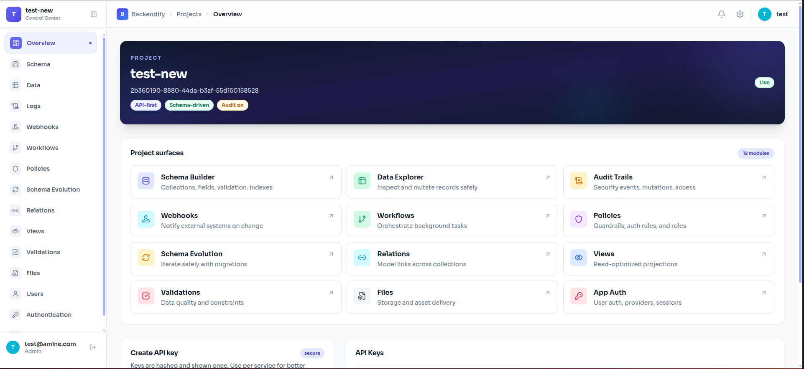
</p>

### Schema Builder
<p align="center">
  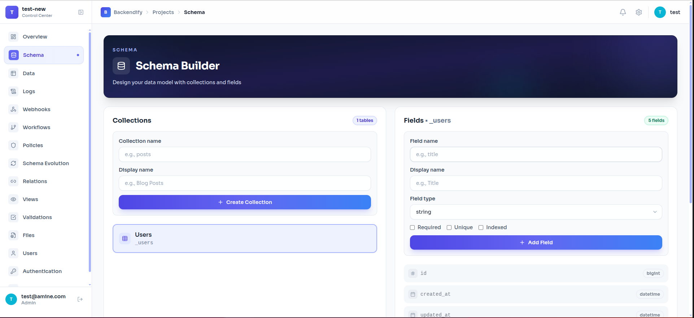
</p>

### Validation Rules
<p align="center">
  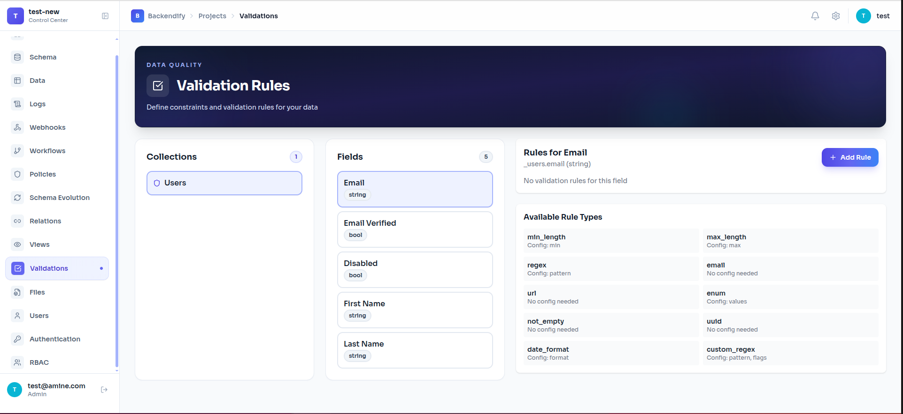
</p>

### User Management
<p align="center">
  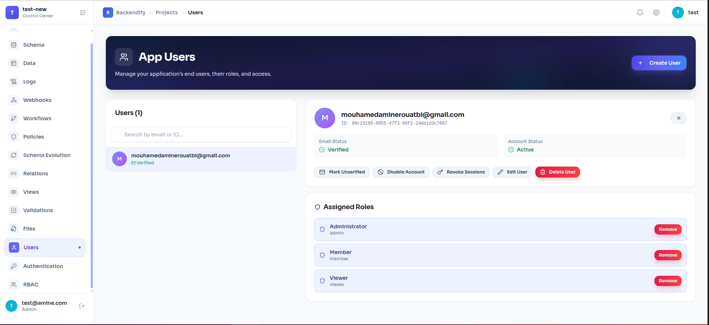
</p>

### Authentication Providers
<p align="center">
  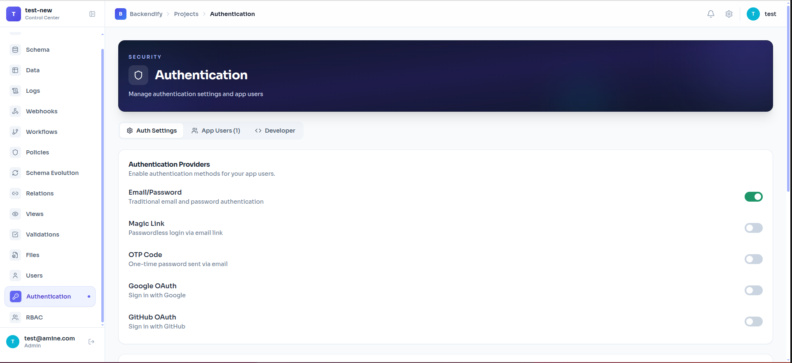
</p>

### Role-Based Access Control
<p align="center">
  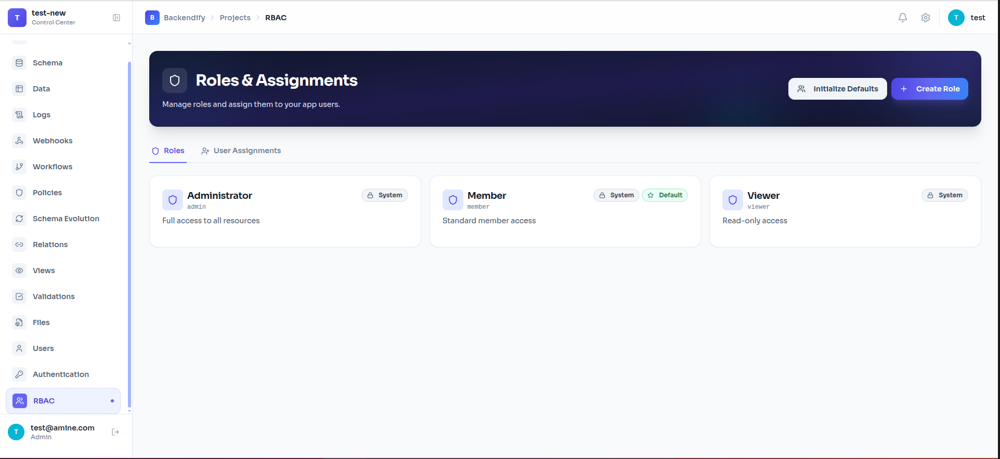
</p>

### File Storage
<p align="center">
  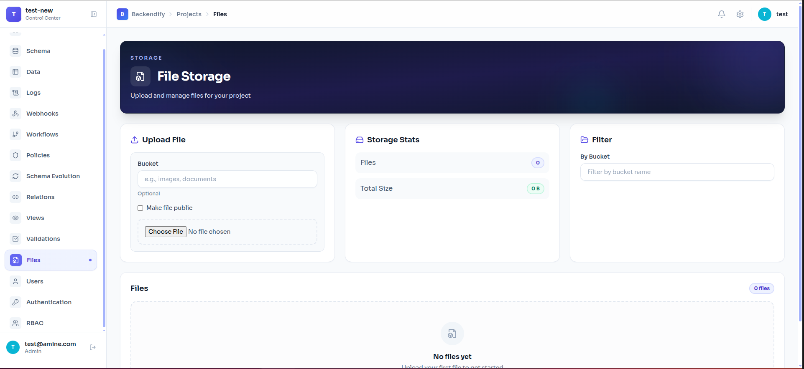
</p>

### Audit Logs
<p align="center">
  
</p>

### Webhooks
<p align="center">
  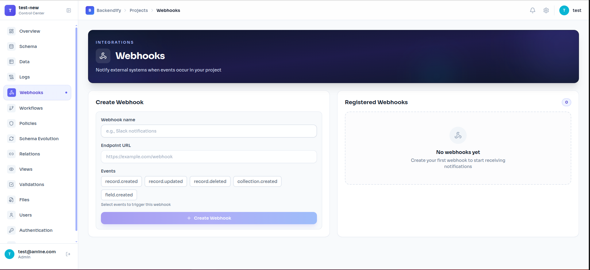
</p>

### Workflows
<p align="center">
  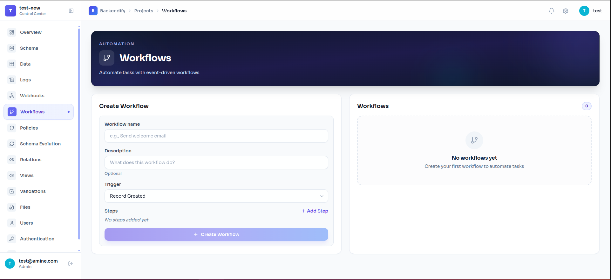
</p>

### Schema Evolution
<p align="center">
  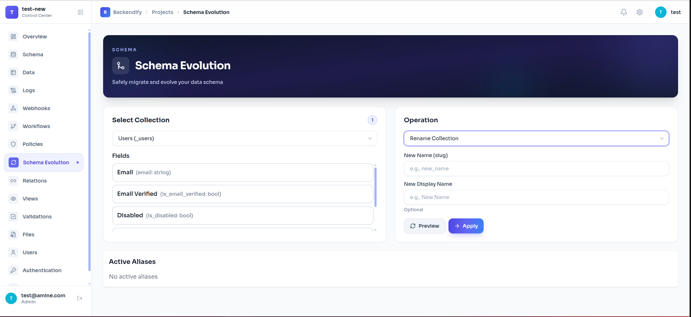
</p>

### Relationship Builder
<p align="center">
  
</p>

---

## ✨ Features

### 🗄️ **Dynamic Schema Builder**
- Create collections (tables) with a visual UI
- Support for multiple field types: `string`, `int`, `float`, `boolean`, `datetime`, `text`, `json`
- Define relationships: `belongs_to`, `has_many`
- Automatic migrations — no SQL required

### 🔐 **Authentication & Authorization**
- **Admin Users**: Console access for project management
- **App Users**: End-user authentication for your applications
- JWT access tokens + refresh token rotation
- API key authentication for server-to-server communication
- Row-level security policies

### 🛡️ **Fine-grained Policies**
- Per-collection, per-action access control (`create`, `read`, `update`, `delete`, `list`)
- Principal-based permissions: `admin_user`, `app_user`, `api_key`, `anonymous`
- Condition-based rules (e.g., "users can only edit their own records")
- Email verification requirements

### 🔍 **Advanced Querying**
- **Filtering**: `?field=value`, `?field__gt=100`, `?field__contains=text`
- **Operators**: `eq`, `neq`, `gt`, `gte`, `lt`, `lte`, `contains`, `startswith`, `endswith`, `in`, `notin`, `isnull`
- **Sorting**: `?sort=-created_at,name` (prefix with `-` for descending)
- **Pagination**: `?limit=50&offset=0`

### 📊 **Data Explorer**
- Browse, create, edit, and delete records
- Visual data management interface
- Export and import data

### 📝 **Audit Logs**
- Track all data changes automatically
- Filter by user, action, collection, date
- Compliance and debugging support

### 🔗 **Webhooks**
- HTTP callbacks on data events
- Configurable per collection
- Retry with exponential backoff

### ⚡ **Workflows**
- Automate actions on events
- Chain multiple operations
- Template variables for dynamic data

### 🔄 **Schema Evolution**
- Track pending schema changes
- Apply migrations safely
- Version control for your schema

### 🔗 **Relations**
- `belongs_to` (many-to-one)
- `has_many` (one-to-many)
- Query related data easily

### 👁️ **Views**
- Virtual collections with joins
- Pre-filtered data
- Aggregations and computed fields

### ✅ **Validations**
- Field-level validation rules
- Email, URL, regex, min/max, enum
- Custom error messages

### 📁 **File Storage**
- Upload and manage files
- Organize in folders
- Secure access control

### 👤 **App Auth**
- End-user authentication
- Separate from admin auth
- JWT tokens with refresh

---

## 🏗️ Architecture

```
┌─────────────────────────────────────────────────────────────────┐
│                        Your Application                          │
│                   (React, Vue, Mobile, etc.)                     │
└─────────────────────────────────────────────────────────────────┘
                                │
                                ▼
┌─────────────────────────────────────────────────────────────────┐
│                      Backendify API                              │
│  ┌──────────┐  ┌──────────┐  ┌──────────┐  ┌──────────────────┐ │
│  │   Auth   │  │   Data   │  │  Schema  │  │     Policies     │ │
│  │  /auth   │  │  /data   │  │ /schema  │  │    /policies     │ │
│  └──────────┘  └──────────┘  └──────────┘  └──────────────────┘ │
└─────────────────────────────────────────────────────────────────┘
                                │
                                ▼
┌─────────────────────────────────────────────────────────────────┐
│                        PostgreSQL                                │
│              (Dynamic tables per project/collection)             │
└─────────────────────────────────────────────────────────────────┘
```

---

## 🚀 Quick Start

### Prerequisites
- Docker & Docker Compose

### 1. Clone and Setup

```bash
git clone https://github.com/yourusername/backendify.git
cd backendify
cp .env.example .env
```

### 2. Start Services

```bash
docker compose up --build
```

### 3. Access

| Service | URL |
|---------|-----|
| **Admin Console** | http://localhost:5173 |
| **API Docs (Swagger)** | http://localhost:8000/docs |
| **API (ReDoc)** | http://localhost:8000/redoc |

### 4. Create Your First Project

1. Register an admin account at http://localhost:5173/register
2. Create a new project
3. Use the Schema Builder to define collections
4. Configure policies for access control
5. Start using the REST API!

---

## 📚 API Reference

### Authentication

#### Admin Authentication
```bash
# Register
POST /api/auth/register
{ "email": "admin@example.com", "password": "securepass" }

# Login
POST /api/auth/login
{ "email": "admin@example.com", "password": "securepass" }
# Returns: { "access_token": "...", "refresh_token": "..." }
```

#### App User Authentication (for your end users)
```bash
# Register app user
POST /api/projects/{project_id}/auth/register
{ "email": "user@example.com", "password": "userpass" }

# Login app user
POST /api/projects/{project_id}/auth/login
{ "email": "user@example.com", "password": "userpass" }
```

### Data Operations

```bash
# List records (with filtering & sorting)
GET /api/projects/{project_id}/data/{collection}?published=true&sort=-created_at

# Get single record
GET /api/projects/{project_id}/data/{collection}/{id}

# Create record
POST /api/projects/{project_id}/data/{collection}
{ "title": "Hello World", "content": "..." }

# Update record
PATCH /api/projects/{project_id}/data/{collection}/{id}
{ "title": "Updated Title" }

# Delete record
DELETE /api/projects/{project_id}/data/{collection}/{id}
```

### Advanced Filtering

| Operator | Example | Description |
|----------|---------|-------------|
| `eq` (default) | `?status=active` | Equals |
| `neq` | `?status__neq=deleted` | Not equals |
| `gt` / `gte` | `?price__gte=100` | Greater than (or equal) |
| `lt` / `lte` | `?price__lt=500` | Less than (or equal) |
| `contains` | `?name__contains=john` | Contains substring |
| `startswith` | `?name__startswith=A` | Starts with |
| `endswith` | `?email__endswith=@gmail.com` | Ends with |
| `in` | `?status__in=active,pending` | Value in list |
| `notin` | `?status__notin=deleted` | Value not in list |
| `isnull` | `?deleted_at__isnull=true` | Is null |

---

## 🔧 Configuration

### Environment Variables

| Variable | Description | Default |
|----------|-------------|---------|
| `DATABASE_URL` | PostgreSQL connection string | `postgresql://...` |
| `JWT_SECRET` | Secret key for JWT tokens | (required) |
| `JWT_ALGORITHM` | JWT algorithm | `HS256` |
| `ACCESS_TOKEN_EXPIRE_MINUTES` | Access token TTL | `30` |
| `REFRESH_TOKEN_EXPIRE_DAYS` | Refresh token TTL | `7` |
| `CORS_ORIGINS` | Allowed CORS origins | `*` |

---

## 🛠️ Development

### Backend (FastAPI)

```bash
cd backend
python -m venv .venv
source .venv/bin/activate
pip install -r requirements.txt
alembic upgrade head
uvicorn app.main:app --reload
```

### Frontend (React + Vite)

```bash
cd frontend
npm install
npm run dev
```

### Run Tests

```bash
cd backend
pytest
```

---

## 📁 Project Structure

```
backendify/
├── backend/
│   ├── alembic/              # Database migrations
│   ├── app/
│   │   ├── api/
│   │   │   ├── routes/       # API endpoints
│   │   │   └── deps.py       # Dependencies (auth, db)
│   │   ├── core/             # Config, security
│   │   ├── models/           # SQLAlchemy models
│   │   ├── schemas/          # Pydantic schemas
│   │   ├── services/         # Business logic
│   │   └── main.py           # FastAPI app
│   └── requirements.txt
├── frontend/
│   ├── src/
│   │   ├── components/       # Reusable UI components
│   │   ├── routes/           # Page components
│   │   ├── lib/              # API client, auth helpers
│   │   └── main.tsx
│   └── package.json
├── examples/
│   ├── blog-app/             # Example blog application
│   └── todo-app/             # Example todo application
├── docker-compose.yml
└── README.md
```

---

## 📖 Examples

### Blog App Example

A full-featured blog with categories, posts, and comments. See [`examples/blog-app/`](./examples/blog-app/).

```bash
cd examples/blog-app
npm install
npm run dev
```

### Todo App Example

A simple todo list demonstrating CRUD operations. See [`examples/todo-app/`](./examples/todo-app/).

---

## 🗺️ Roadmap

- [x] Dynamic schema builder
- [x] JWT authentication (admin + app users)
- [x] API key authentication
- [x] Row-level security policies
- [x] Advanced filtering & sorting
- [x] Audit logs
- [x] Webhooks
- [x] Field validations
- [x] File/media storage
- [x] Email verification flow
- [ ] Real-time subscriptions (WebSocket)
- [ ] OAuth/Social login
- [ ] Rate limiting
- [ ] GraphQL API

---

## 🤝 Contributing

Contributions are welcome! Please read our contributing guidelines before submitting a PR.

1. Fork the repository
2. Create your feature branch (`git checkout -b feature/amazing-feature`)
3. Commit your changes (`git commit -m 'Add amazing feature'`)
4. Push to the branch (`git push origin feature/amazing-feature`)
5. Open a Pull Request

---

## 📄 License

This project is licensed under the MIT License - see the [LICENSE](LICENSE) file for details.

---

## 🙏 Acknowledgments

- [FastAPI](https://fastapi.tiangolo.com/) - Modern Python web framework
- [SQLAlchemy](https://www.sqlalchemy.org/) - Python SQL toolkit
- [React](https://react.dev/) - UI library
- [TanStack Router](https://tanstack.com/router) - Type-safe routing
- [Tailwind CSS](https://tailwindcss.com/) - Utility-first CSS
- [shadcn/ui](https://ui.shadcn.com/) - UI components

---

<p align="center">
  Made with ❤️ by the Backendify team
</p>
